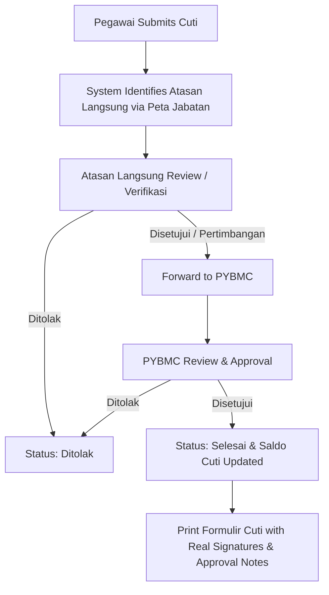

# Multi-Stage Leave Approval Workflow (Atasan Langsung & PYBMC)

This document outlines the design and implementation plan for introducing a two-stage approval workflow for employee leave requests (**Layanan Cuti**):
1. **Immediate Supervisor (Atasan Langsung)** verification & approval (dynamically identified via **Peta Jabatan**).
2. **Pejabat Yang Berwenang Memberikan Cuti (PYBMC)** final approval (designated manually by the personnel department / **Kepegawaian**).

---

## User Review Required

> [!IMPORTANT]
> **Workflow Transitions & Statuses**:
> - **Stage 1 (Pengajuan)**: Employee submits leave request $\rightarrow$ status `menunggu_atasan` (or `usulan`).
> - **Stage 2 (Persetujuan Atasan Langsung)**: Immediate supervisor identified via `peta_jabatan` reviews the usulan $\rightarrow$ approves with pertimbangan (disetujui / perubahan / ditangguhkan / ditolak) $\rightarrow$ status moves to `menunggu_pybmc` (or `ditolak` if rejected).
> - **Stage 3 (Keputusan PYBMC)**: Manually designated PYBMC reviews $\rightarrow$ makes final decision (disetujui / ditolak) $\rightarrow$ status becomes `selesai` (deducts leave balance) or `ditolak`.
>
> Please confirm if any additional statuses or intermediate steps (such as Kepegawaian administrative verification between supervisor and PYBMC) are needed.

---

## Architecture & Design

### 1. Superior Identification (Atasan Langsung)
- Uses the hierarchical structure defined in `jabatans.atasan_langsung_id` and unit kerja matching.
- Any logged-in user whose linked `Pegawai` has subordinates with pending cuti usulan will see their approval queue under a dedicated **Persetujuan Cuti (Atasan)** view.

### 2. PYBMC Designation (Personnel Department / Kepegawaian)
- Kepegawaian can designate who serves as the active **PYBMC** (e.g. Rektor / Wakil Rektor / Kepala Biro / specific Pegawai & Jabatan).
- Stored in a dedicated system configuration / settings table or designation model (e.g. `pejabat_cuti_settings` or `cuti_approver_settings`).
- When designated, that user/pegawai gains access to the **Persetujuan Cuti (PYBMC)** review dashboard.

### 3. Data Schema Updates
Extend `cuti_layanan_pegawais` (or add an approval history table) to track:
- `atasan_pegawai_id`, `atasan_user_id`, `atasan_status` (`disetujui`, `perubahan`, `ditangguhkan`, `tidak_disetujui`), `catatan_atasan`, `atasan_approved_at`.
- `pybmc_pegawai_id`, `pybmc_user_id`, `pybmc_status` (`disetujui`, `perubahan`, `ditangguhkan`, `tidak_disetujui`), `catatan_pybmc`, `pybmc_approved_at`.

---

## Proposed Changes

### Database & Migrations
#### [NEW] [create_cuti_approver_settings_and_approval_columns](file:///Users/mac/Projects/sikat/database/migrations/2026_09_13_000001_add_multi_stage_approval_to_cuti_layanan.php)
- Add columns to `cuti_layanan_pegawais` for Atasan Langsung review and PYBMC review.
- Create or configure designation storage for active PYBMC managed by Kepegawaian.

---

### Backend Services & Models
#### [MODIFY] [CutiLayananPegawai.php](file:///Users/mac/Projects/sikat/app/Models/CutiLayananPegawai.php)
- Add relations to Atasan (`Pegawai` / `User`) and PYBMC (`Pegawai` / `User`).
- Helper methods to check approval progression (`isApprovedByAtasan()`, `isApprovedByPybmc()`).

#### [MODIFY] [CutiService.php](file:///Users/mac/Projects/sikat/app/Services/CutiService.php)
- Update `resolveAtasanLangsung(Pegawai $pegawai)`.
- Add `resolveDesignatedPybmc(): ?Pegawai`.
- Update `buildPrintableFormData()` to populate Section VII and Section VIII using actual recorded approver names, NIPs, and decisions.

---

### Controllers & Routes
#### [NEW/MODIFY] [CutiApprovalController.php](file:///Users/mac/Projects/sikat/app/Http/Controllers/Front/CutiApprovalController.php)
- `indexAtasan()`: Queue of subordinate leave requests requiring immediate supervisor approval.
- `approveAtasan()`: Process supervisor verification and forward to PYBMC.
- `indexPybmc()`: Queue of supervisor-approved leave requests requiring PYBMC final approval.
- `approvePybmc()`: Process PYBMC final approval.
- `pybmcSetting()` / `updatePybmcSetting()`: Kepegawaian module to designate the active PYBMC.

#### [MODIFY] [web.php](file:///Users/mac/Projects/sikat/routes/web.php)
- Register routes for Atasan approval, PYBMC approval, and Kepegawaian PYBMC configuration.

---

### Views & UI
#### [NEW] `resources/views/layanan/cuti-approval/atasan-index.blade.php`
- Queue table and approval modal for immediate supervisors.

#### [NEW] `resources/views/layanan/cuti-approval/pybmc-index.blade.php`
- Queue table and approval modal for PYBMC.

#### [NEW] `resources/views/kepegawaian/cuti/pybmc-setting.blade.php`
- Designation interface for Kepegawaian to select the active PYBMC.

#### [MODIFY] [cuti-print.blade.php](file:///Users/mac/Projects/sikat/resources/views/pegawai/cuti-print.blade.php)
- Populate Section VII (Atasan Langsung) and Section VIII (PYBMC) with recorded signatures, titles, and checked options.

#### [MODIFY] [sidebar.blade.php](file:///Users/mac/Projects/sikat/resources/views/layouts/sidebar.blade.php)
- Add navigation badges / links for supervisors with subordinates and for the designated PYBMC.

---

## Verification Plan

### Automated Tests
- `tests/Feature/CutiMultiStageApprovalTest.php`:
  1. Test employee submits leave request $\rightarrow$ appears in immediate supervisor's queue based on peta jabatan.
  2. Test immediate supervisor approves $\rightarrow$ moves to PYBMC queue.
  3. Test non-subordinate cannot access or approve another employee's cuti.
  4. Test Kepegawaian designates PYBMC $\rightarrow$ designated PYBMC can view and provide final approval.
  5. Test final PYBMC approval sets status to `selesai` and properly updates leave balance calculation.
  6. Test rejection at either stage updates status to `ditolak` with remarks.
  7. Test print formulir cuti outputs correct names, NIPs, and approval checks.

### Manual Verification
- Log in as employee $\rightarrow$ submit cuti.
- Log in as immediate supervisor $\rightarrow$ review & approve subordinate cuti.
- Log in as designated PYBMC $\rightarrow$ review & finalize approval.
- Check generated print PDF / printable form.
